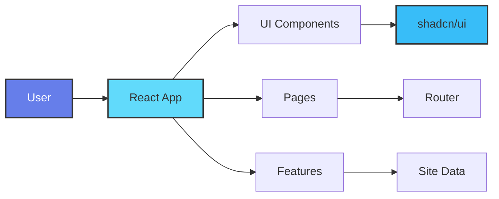
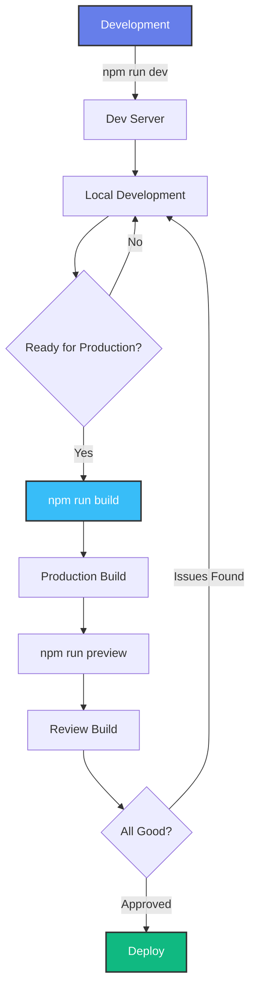
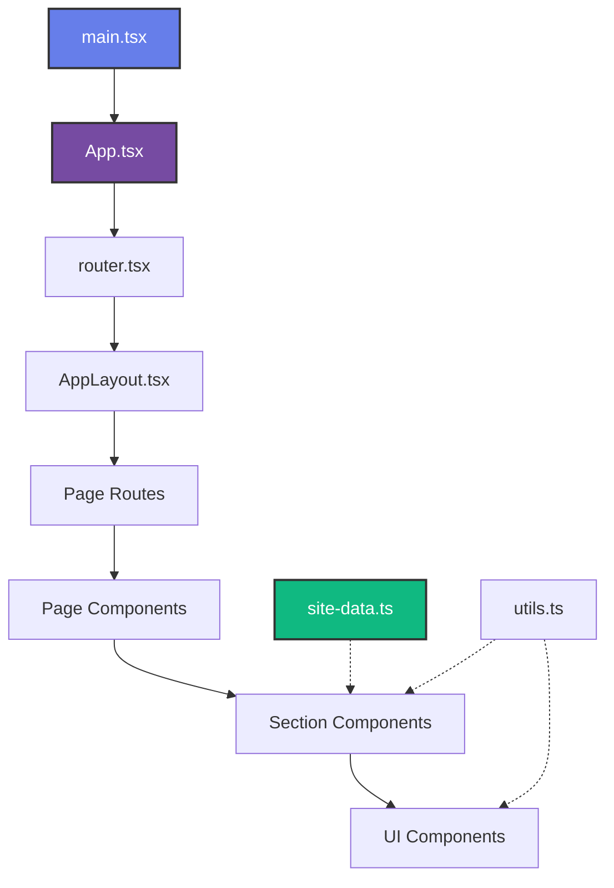
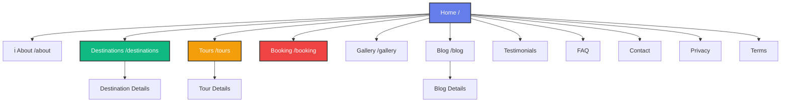
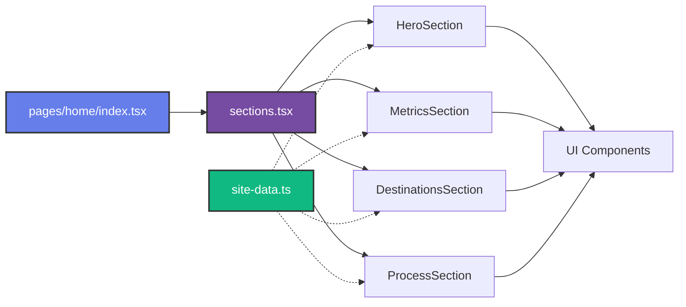
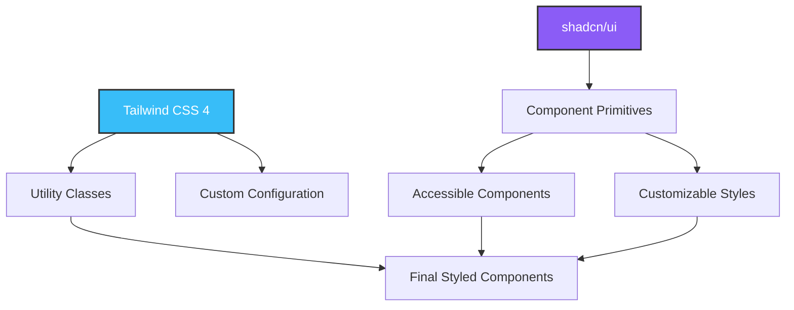
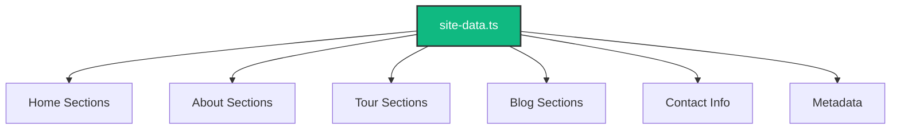
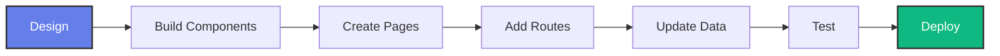

<div align="center">

#  TravelTime

### Modern Travel Booking Platform

*A Vite + React + TypeScript single-page app with a multi-page marketing layout*


[Getting Started](#-getting-started) • [Tech Stack](#-tech-stack) • [Project Structure](#-project-structure) • [Scripts](#-scripts)

</div>

---

##  Table of Contents

- [Overview](#-overview)
- [Tech Stack](#-tech-stack)
- [Getting Started](#-getting-started)
- [Scripts](#-scripts)
- [Project Structure](#-project-structure)
- [Architecture](#-architecture)
- [Pages & Routes](#-pages--routes)
- [Component Organization](#-component-organization)
- [Notes](#-notes)

---

##  Overview

TravelTime is a comprehensive travel booking platform featuring a modern, responsive design built with cutting-edge web technologies. The application provides a seamless user experience for browsing destinations, booking tours, and managing travel plans.


---

## 🛠 Tech Stack

<table>
<tr>
<td width="50%">

### Core Framework
```
┌─────────────────────────────┐
│   Vite 7                  │
│  Build Tool & Dev Server    │
└─────────────────────────────┘
         │
         ▼
┌─────────────────────────────┐
│    React 19               │
│  UI Library                 │
└─────────────────────────────┘
         │
         ▼
┌─────────────────────────────┐
│   TypeScript 5            │
│  Type Safety                │
└─────────────────────────────┘
```

</td>
<td width="50%">

### Styling & Routing
```
┌─────────────────────────────┐
│   Tailwind CSS 4          │
│  Utility-First CSS          │
└─────────────────────────────┘
         │
         ▼
┌─────────────────────────────┐
│   shadcn/ui               │
│  Component Primitives       │
└─────────────────────────────┘
         │
         ▼
┌─────────────────────────────┐
│    React Router 7         │
│  Client-Side Routing        │
└─────────────────────────────┘
```

</td>
</tr>
</table>

### Technology Overview

| Technology | Version | Purpose |
|------------|---------|---------|
| **Vite** | 7 |  Lightning-fast build tool and dev server |
| **React** | 19 |  Component-based UI library |
| **TypeScript** | 5 |  Static type checking and IntelliSense |
| **React Router** | 7 |  Declarative routing for React |
| **Tailwind CSS** | 4 |  Utility-first CSS framework |
| **shadcn/ui** | Latest |  High-quality component primitives |

---

## Getting Started

### Prerequisites
```bash
# Node.js (v18 or higher)
node --version

# npm (comes with Node.js)
npm --version
```

### Installation
```bash
# Clone the repository
git clone 

# Navigate to project directory
cd TravelTime

# Install dependencies
npm install

# Start development server
npm run dev
```

---

## Scripts

<table>
<tr>
<td width="33%">

###  Development
```bash
npm run dev
```
**Purpose:** Start the development server

**Features:**
-  Hot Module Replacement
-  Fast refresh
-  Source maps
-  Mobile preview

</td>
<td width="33%">

### Build
```bash
npm run build
```
**Purpose:** Type-check and build for production

**Process:**
-  TypeScript validation
-  Bundle optimization
-  Code minification
-  Tree shaking

</td>
<td width="33%">

### Preview
```bash
npm run preview
```
**Purpose:** Preview the production build

**Features:**
-  Production simulation
-  Build verification
-  Performance testing
-  Final QA

</td>
</tr>
</table>

### Command Flow Diagram


---

## 📁 Project Structure

### High-Level Overview
```
TravelTime/
├── 📂 public/          # Static assets
├── 📂 src/             # Source code
├── 📄 index.html       # Entry HTML
├── 📦 package.json     # Dependencies
└── ⚙️  vite.config.ts  # Vite configuration
```

### Detailed Structure
```
TravelTime/
│
├── 📂 public/
│   └── 📂 assets/
│       └── 📂 img/
│           ├── 📁 blog/              # Blog images
│           ├── 📁 gallery/           # Gallery photos
│           ├── 📁 person/            # Team/user avatars
│           ├── 📁 travel/            # Travel destination images
│           ├── 🍎 apple-touch-icon.png
│           ├── 🔖 favicon.png
│           └── 🌐 logo.webp
│
├── 📂 src/
│   ├── 📂 app/
│   │   ├── 📄 AppLayout.tsx         # Main layout wrapper
│   │   └── 📄 router.tsx            # Route configuration
│   │
│   ├── 📂 components/
│   │   ├── 📂 page/                 # Shared page components
│   │   │   ├── MetricsGrid.tsx
│   │   │   └── PageHero.tsx
│   │   │
│   │   ├── 📂 pages/                # Page-specific components
│   │   │   ├── 📁 about/
│   │   │   ├── 📁 blog/
│   │   │   ├── 📁 blog-details/
│   │   │   ├── 📁 booking/
│   │   │   ├── 📁 contact/
│   │   │   ├── 📁 destination-details/
│   │   │   ├── 📁 destinations/
│   │   │   ├── 📁 faq/
│   │   │   ├── 📁 gallery/
│   │   │   ├── 📁 home/
│   │   │   ├── 📁 not-found/
│   │   │   ├── 📁 privacy/
│   │   │   ├── 📁 starter-page/
│   │   │   ├── 📁 terms/
│   │   │   ├── 📁 testimonials/
│   │   │   ├── 📁 tour-details/
│   │   │   └── 📁 tours/
│   │   │
│   │   └── 📂 ui/                   # Reusable UI components
│   │       ├── badge.tsx
│   │       ├── button.tsx
│   │       ├── card.tsx
│   │       ├── input.tsx
│   │       └── textarea.tsx
│   │
│   ├── 📂 features/
│   │   └── 📂 content/
│   │       └── 📄 site-data.ts      # Central data source
│   │
│   ├── 📂 lib/
│   │   └── 📄 utils.ts              # Utility functions
│   │
│   ├── 📂 pages/                    # Route entry points
│   │   ├── 📁 about/
│   │   ├── 📁 blog/
│   │   ├── 📁 blog-details/
│   │   ├── 📁 booking/
│   │   ├── 📁 contact/
│   │   ├── 📁 destination-details/
│   │   ├── 📁 destinations/
│   │   ├── 📁 faq/
│   │   ├── 📁 gallery/
│   │   ├── 📁 home/
│   │   ├── 📁 not-found/
│   │   ├── 📁 privacy/
│   │   ├── 📁 starter-page/
│   │   ├── 📁 terms/
│   │   ├── 📁 testimonials/
│   │   ├── 📁 tour-details/
│   │   └── 📁 tours/
│   │
│   ├── 📄 App.tsx                   # Root component
│   ├── 🎨 index.css                 # Global styles
│   └── 📄 main.tsx                  # Application entry
│
├── 📄 components.json               # shadcn/ui config
├── 📄 index.html                    # HTML template
├── 📦 package.json                  # Project dependencies
├── 🔒 package-lock.json             # Locked dependencies
├── 📘 tsconfig.json                 # TypeScript config
└── ⚙️  vite.config.ts               # Vite configuration
```

---

## Architecture

### Application Flow


### Component Hierarchy
```
┌─────────────────────────────────────────────┐
│              main.tsx (Entry)               │
│                     │                       │
│                     ▼                       │
│              App.tsx (Root)                 │
│                     │                       │
│                     ▼                       │
│            router.tsx (Routes)              │
│                     │                       │
│                     ▼                       │
│          AppLayout.tsx (Layout)             │
│                     │                       │
│         ┌───────────┴───────────┐           │
│         ▼                       ▼           │
│   Page Component          Page Component    │
│         │                       │           │
│    ┌────┴────┐             ┌────┴────┐     │
│    ▼         ▼             ▼         ▼     │
│ Section  Section        Section  Section   │
│    │         │             │         │     │
│    └────┬────┘             └────┬────┘     │
│         ▼                       ▼           │
│    UI Components          UI Components     │
└─────────────────────────────────────────────┘
```

---

## Pages & Routes

### Route Structure

<table>
<tr>
<th>Route</th>
<th>Page</th>
<th>Description</th>
<th>Sections</th>
</tr>

<tr>
<td><code>/</code></td>
<td><strong>Home</strong></td>
<td>Landing page</td>
<td>

- Hero
- Metrics
- Destinations
- Featured Route
- Planner
- Process
- Tours & Testimonials
- CTA

</td>
</tr>

<tr>
<td><code>/about</code></td>
<td><strong>About</strong></td>
<td>Company information</td>
<td>

- Hero
- Mission
- Principles
- Operating Model
- Team
- Work
- CTA

</td>
</tr>

<tr>
<td><code>/destinations</code></td>
<td><strong>Destinations</strong></td>
<td>Browse destinations</td>
<td>

- Hero
- Search
- Feature Cards
- Grid

</td>
</tr>

<tr>
<td><code>/destination-details</code></td>
<td><strong>Destination Details</strong></td>
<td>Specific destination</td>
<td>

- Hero
- Stats
- Detail Grid

</td>
</tr>

<tr>
<td><code>/tours</code></td>
<td><strong>Tours</strong></td>
<td>Available tours</td>
<td>

- Hero
- Feature
- Grid

</td>
</tr>

<tr>
<td><code>/tour-details</code></td>
<td><strong>Tour Details</strong></td>
<td>Specific tour info</td>
<td>

- Hero
- Detail Grid
- Itinerary

</td>
</tr>

<tr>
<td><code>/booking</code></td>
<td><strong>Booking</strong></td>
<td>Book a tour</td>
<td>

- Hero
- Process
- Benefit
- Form
- Assurance

</td>
</tr>

<tr>
<td><code>/gallery</code></td>
<td><strong>Gallery</strong></td>
<td>Photo gallery</td>
<td>

- Hero
- Feature
- Collections
- Grid

</td>
</tr>

<tr>
<td><code>/blog</code></td>
<td><strong>Blog</strong></td>
<td>Blog listing</td>
<td>

- Hero
- Featured
- Posts
- Subscribe

</td>
</tr>

<tr>
<td><code>/blog-details</code></td>
<td><strong>Blog Post</strong></td>
<td>Individual post</td>
<td>

- Hero
- Cover
- Article

</td>
</tr>

<tr>
<td><code>/testimonials</code></td>
<td><strong>Testimonials</strong></td>
<td>Customer reviews</td>
<td>

- Hero
- Testimonials

</td>
</tr>

<tr>
<td><code>/faq</code></td>
<td><strong>FAQ</strong></td>
<td>Frequently asked questions</td>
<td>

- Hero
- FAQ

</td>
</tr>

<tr>
<td><code>/contact</code></td>
<td><strong>Contact</strong></td>
<td>Contact information</td>
<td>

- Hero
- Contact Cards
- Form
- Service Level

</td>
</tr>

<tr>
<td><code>/privacy</code></td>
<td><strong>Privacy Policy</strong></td>
<td>Privacy information</td>
<td>

- Hero
- Privacy

</td>
</tr>

<tr>
<td><code>/terms</code></td>
<td><strong>Terms of Service</strong></td>
<td>Terms & conditions</td>
<td>

- Hero
- Terms

</td>
</tr>

<tr>
<td><code>*</code></td>
<td><strong>404</strong></td>
<td>Page not found</td>
<td>

- Not Found

</td>
</tr>

</table>

### Route Visualization


---

## Component Organization

### Directory Structure Pattern

Each page follows a consistent organization pattern:
```
page-name/
├── components/          # Page-specific sections
│   ├── HeroSection.tsx    # Above-the-fold content
│   ├── Section1.tsx       # Main content section
│   ├── Section2.tsx       # Additional section
│   └── ...
├── sections.tsx        # Section exports
└── (in src/pages/)
    └── index.tsx       # Route entry point
```

### Component Flow Diagram


### Example: Home Page Structure
```
src/
├── pages/home/
│   └── index.tsx                    ← Route Entry
│       └── imports from ↓
├── components/pages/home/
│   ├── sections.tsx                 ← Section Exports
│   └── components/
│       ├── HeroSection.tsx          ← Individual Sections
│       ├── MetricsSection.tsx
│       ├── DestinationsSection.tsx
│       ├── FeaturedRouteSection.tsx
│       ├── PlannerSection.tsx
│       ├── ProcessSection.tsx
│       ├── ToursTestimonialsSection.tsx
│       └── CtaSection.tsx
│           └── uses ↓
└── components/ui/                   ← Shared UI Components
    ├── button.tsx
    ├── card.tsx
    └── ...
```

### UI Components Library

The `components/ui/` folder contains reusable, styled components:
```
 ui/
├── badge.tsx       # Status badges, labels
├── button.tsx      # Interactive buttons
├── card.tsx        # Content cards
├── input.tsx       # Form inputs
└── textarea.tsx    # Multi-line text inputs
```

These components are built using **shadcn/ui** primitives and styled with **Tailwind CSS**.

---

## Styling Architecture


---

## Data Management

### Central Data Source

All content is managed through a central data file:
```
src/features/content/site-data.ts
```

**Benefits:**
- Single source of truth
- Easy content updates
- Centralized translations (future)
- Simple maintenance


---

## Notes

### Key Architectural Decisions

1. **Route Entry Points**
```
   src/pages/*/index.tsx
```
   - Each page has a dedicated route entry
   - Clean separation of routing concerns
   - Easy to understand navigation structure

2. **Section Components**
```
   src/components/pages/*
```
   - Modular, reusable page sections
   - Consistent component patterns
   - Maintainable codebase

3. **Central Data Source**
```
   src/features/content/site-data.ts
```
   - Single source of truth for content
   - Simplified content management
   - Easy updates without code changes

### Development Workflow


### Component Reusability Matrix

| Component Type | Reusability | Location | Example |
|---------------|-------------|----------|---------|
| **UI Primitives** |  High | `components/ui/` | Button, Card, Input |
| **Page Components** |  Medium | `components/page/` | PageHero, MetricsGrid |
| **Section Components** | Low | `components/pages/*/` | HeroSection, AboutSection |
| **Page Routes** | None | `pages/*/` | Home, About, Tours |

---

## Contributing

Contributions are welcome! Please follow these guidelines:

1. Fork the repository
2. Create a feature branch
3. Make your changes
4. Test thoroughly
5. Submit a pull request

---

## License

This project is licensed under the MIT License - see the LICENSE file for details.

---

## Contact

For questions or support, please contact the development team.

---

<div align="center">

**Built by pthanksdev  using React, TypeScript, and Tailwind CSS**

 Star this repository if you find it helpful!

</div>